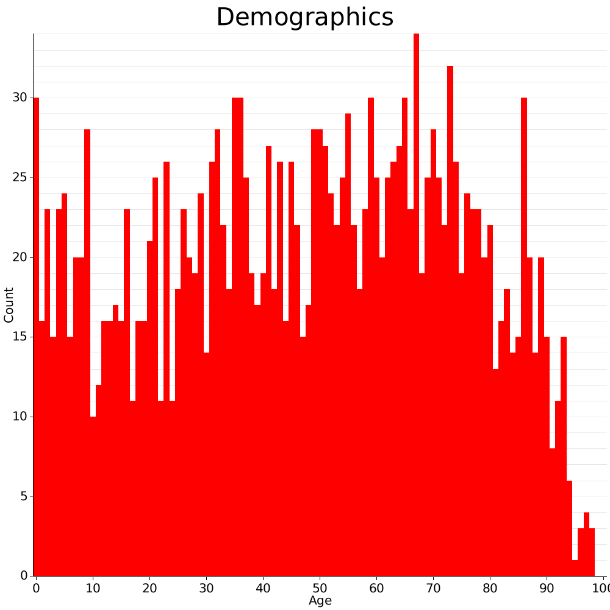

<h1 align="center">Episim</h1>

Simulating epidemics

<h2>Configuration</h2>

Each configuration has its own folder consisting of two files. Check the example configurations if in doubt.

<ul>
    <li>core.cfg. Contains various simulation parameters.</li>
    <li>demographic.csv. Determines the demographic composition of the simulations population. CSV files for countries can be downloaded at <a href="https://www.populationpyramid.net/">populationpyramid.net</a></li>
    <li>(Source code). Toggle the live visualisation by uncommenting the one you want to use (<a href="https://github.com/cherrysrc/episim/blob/master/src/main.rs#L38">main.rs</a>). Keep in mind the graphic version will take longer to run.</li>
    <li>(Source code). You can adjust the source code to adjust the simulation parameters. Some parameters, such as the functions computing the infection and survival chances, are easily accessible via the static config object in <a href="https://github.com/cherrysrc/episim/blob/master/src/main.rs#L17">main.rs</a>. Serializing these could be a future improvement.</li>
</ul>

<h2>Gallery</h2>

    </img>
    </img>

Higher test rate

    </img>
    </img>

Shorter recovered period

    </img>
    </img>

Pyramid demographic

    </img>
    </img>

Without reinfection

    </img>
    </img>

